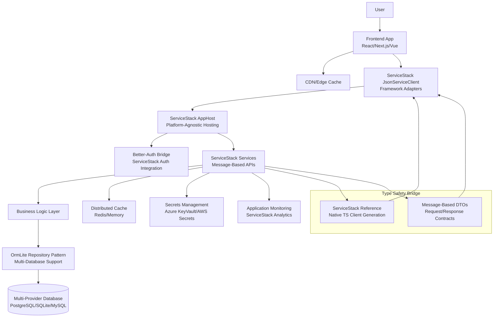
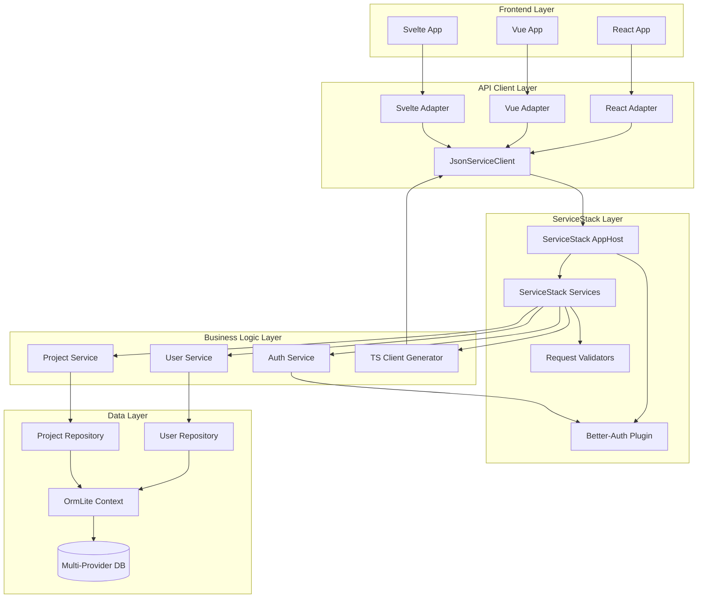
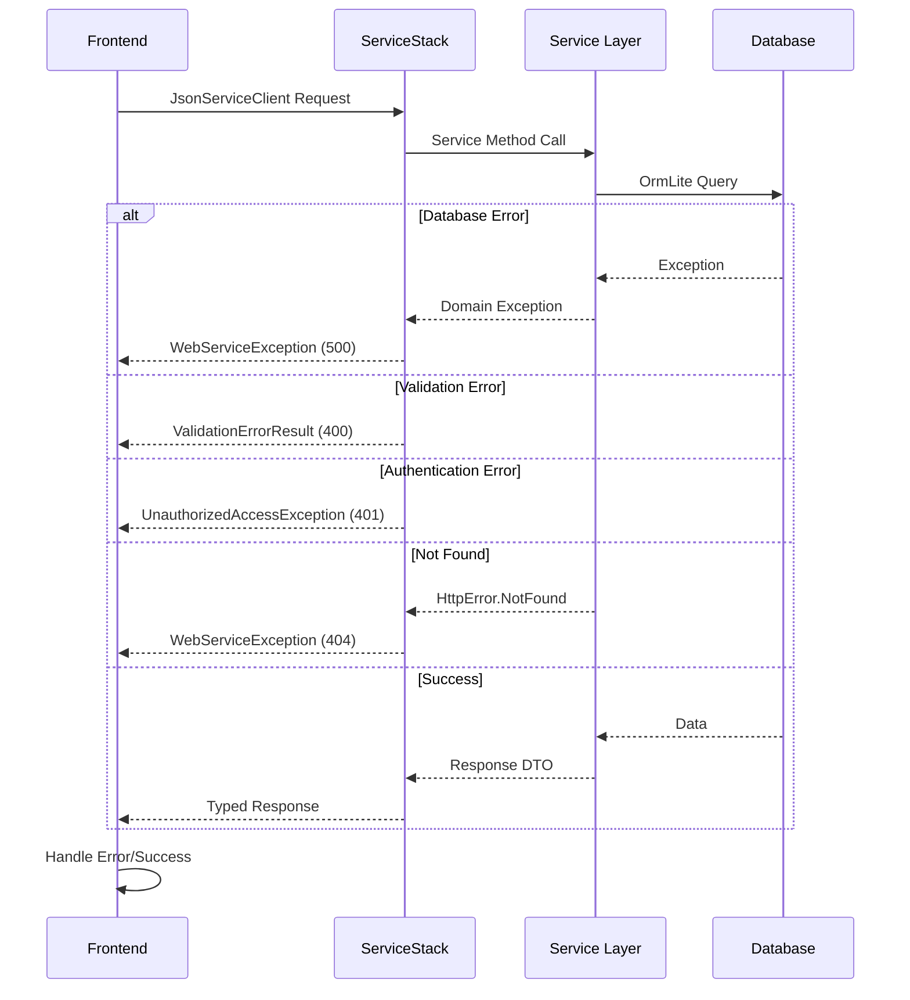

# Create Better T Stack - ServiceStack Integration Architecture

## Introduction

This document outlines the complete integration architecture for adding ServiceStack as a new backend option to the Create Better T Stack CLI tool. The Create Better T Stack CLI is a modern scaffolding tool that generates end-to-end type-safe TypeScript projects with customizable configurations.

The CLI currently generates projects with multiple backend framework options. This architecture extends that capability to include ServiceStack (.NET 8), enabling the CLI to scaffold full-stack projects that bridge TypeScript frontends with C# backends while maintaining the tool's core principles of type safety, developer experience, and rapid scaffolding.

### CLI Integration Context

The Create Better T Stack CLI currently supports multiple backend frameworks:
- **hono** - Ultrafast web framework
- **express** - Traditional Node.js web framework  
- **fastify** - Fast and low overhead web framework
- **next** - Full-stack React framework with API routes
- **elysia** - TypeScript framework with end-to-end type safety
- **convex** - Reactive backend-as-a-service platform
- **none** - Frontend-only projects

This architecture adds **servicestack-dotnet** (.NET 8) as a new backend option, requiring:

- Seamless integration with existing CLI scaffolding workflows in `apps/cli/src/`
- New Handlebars templates in `apps/cli/templates/backend/server/servicestack-dotnet/`
- Built-in TypeScript client generation using ServiceStack's native tools
- Consistent developer experience with other backend options
- Integration with existing setup helpers in `apps/cli/src/helpers/setup/`

### Template-Driven Code Generation

The integration leverages the CLI's existing Handlebars template system with 900+ existing template files. New ServiceStack templates will be added to:

```
apps/cli/templates/backend/server/servicestack-dotnet/
├── ServiceModel/
│   ├── User.cs.hbs
│   ├── {{#if auth}}Auth.cs.hbs{{/if}}
│   └── {{#if examples}}Todo.cs.hbs{{/if}}
├── ServiceInterface/
│   ├── IUserService.cs.hbs
│   └── {{#if auth}}IAuthService.cs.hbs{{/if}}
├── Services/
│   ├── UserService.cs.hbs
│   └── {{#if auth}}AuthService.cs.hbs{{/if}}
├── Data/
│   ├── AppDbContext.cs.hbs
│   └── {{database}}Configuration.cs.hbs
├── AppHost.cs.hbs
├── Program.cs.hbs
├── {{{projectName}}}.csproj.hbs
└── Dockerfile.hbs
```

**CLI Integration Requirements:**

1. **Type Definition Extension**: Add `"servicestack-dotnet"` to `BackendSchema` in `apps/cli/src/types.ts`
2. **Backend Selection**: Update `apps/cli/src/prompts/backend.ts` to include ServiceStack option
3. **Setup Helper**: Create `apps/cli/src/helpers/setup/servicestack-setup.ts` for .NET-specific setup
4. **Template Processing**: Extend template manager in `apps/cli/src/helpers/project-generation/template-manager.ts`
5. **Package Configuration**: Update package.json generation for .NET projects
6. **Documentation Integration**: Add ServiceStack to CLI's help system and examples

### Fork Management Strategy

This implementation is designed for a fork of the original project with the following constraints:
- **Upstream Sync**: Major releases only from upstream repository
- **Isolation Principle**: ServiceStack integration as additive feature only
- **Compatibility**: Zero breaking changes to existing CLI functionality
- **Versioning**: `{upstream.version}-dotnet.{increment}` format

### Change Log

| Date | Version | Description | Author |
|------|---------|-------------|---------|
| 2025-01-02 | 1.0 | Initial ServiceStack architecture document | Solution Architect Agent |

## High Level Architecture

### Technical Summary

The architecture implements a type-safe full-stack solution bridging TypeScript frontends with ServiceStack backends through native message-based APIs. The system leverages ServiceStack's built-in TypeScript client generation, eliminating the need for custom code generation tools. Key integration points include automated TypeScript DTO generation using ServiceStack's native "Add ServiceStack Reference" functionality, framework-agnostic API clients, and seamless Better-Auth integration with ServiceStack's authentication system.

### Platform and Infrastructure Choice

**Platform:** Multi-Cloud with Platform-Agnostic Deployment
**Key Services:** Azure App Service, Azure SQL Database, AWS, Google Cloud, or VPS deployment options
**Deployment Host and Regions:** Configurable based on user preference and selected database setup
**Current Deployment Integration:** Cloudflare Workers (via existing WebDeploy option)

**Rationale:** The CLI tool generates projects that can be deployed to any platform supporting .NET 8 applications. ServiceStack integration maintains the CLI's platform-agnostic philosophy while providing optimal defaults.

**Database Integration:** 
The CLI currently supports these database setups via `DatabaseSetupSchema`:
- **turso** - SQLite edge database
- **neon** - Serverless PostgreSQL  
- **prisma-postgres** - PostgreSQL with Prisma
- **mongodb-atlas** - MongoDB cloud database
- **supabase** - Open source Firebase alternative
- **d1** - Cloudflare D1 SQLite
- **docker** - Local development with Docker
- **none** - No database setup

**Alternative Considerations:**
- **Azure**: Excellent .NET ecosystem integration, but shouldn't be the only option
- **AWS**: Good containerization support with ECS/Fargate
- **Google Cloud**: Cloud Run provides serverless .NET hosting
- **VPS/Dedicated**: Traditional hosting for cost-conscious deployments

### Repository Structure

**Structure:** CLI Tool Repository with Template System
**Template Organization:** Handlebars templates organized by framework type in `apps/cli/templates/`
**Code Generation:** ServiceStack's native TypeScript client generation
**Integration Points:** 
- Backend templates in `apps/cli/templates/backend/server/servicestack-dotnet/`
- Setup helpers in `apps/cli/src/helpers/setup/servicestack-setup.ts`
- Type definitions extended in `apps/cli/src/types.ts`
- Prompt system integration in `apps/cli/src/prompts/backend.ts`

**Current CLI Template Structure:**
```
apps/cli/templates/
├── backend/server/
│   ├── hono/              # Existing backend templates
│   ├── express/
│   ├── fastify/
│   ├── elysia/
│   ├── next/
│   └── servicestack-dotnet/ # New ServiceStack templates (to be added)
├── frontend/              # Frontend framework templates
├── api/                   # API layer templates (tRPC/oRPC)
├── db/                    # Database templates (Drizzle/Prisma)
└── auth/                  # Authentication templates
```

### High Level Architecture Diagram



### Architectural Patterns

- **Message-Based APIs:** ServiceStack's native Request/Response DTO pattern - *Rationale:* Provides type-safe API contracts with automatic client generation
- **Repository Pattern:** Abstract data access logic with OrmLite - *Rationale:* Provides testability and enables multi-database provider support (PostgreSQL, MySQL, SQLite, MongoDB)
- **Plugin Architecture:** ServiceStack's plugin system for authentication and features - *Rationale:* Maintains CLI's unified auth experience while leveraging .NET ecosystem
- **Framework Adapter Pattern:** Universal API client with framework-specific optimizations - *Rationale:* Enables consistent API consumption across React, Vue, Svelte, and other frontend frameworks
- **Native Type Generation:** ServiceStack's built-in TypeScript client generation - *Rationale:* Eliminates maintenance overhead of custom code generation tools

## Tech Stack

### Technology Stack Table

| Category | Technology | Version | Purpose | Rationale |
|----------|------------|---------|---------|-----------|
| Frontend Language | TypeScript | ^5.3.0 | Type-safe frontend development | Maintains CLI's existing type safety standards |
| Frontend Framework | Multi-Framework Support | Latest | Universal frontend support | CLI supports: tanstack-router, react-router, tanstack-start, next, nuxt, native-nativewind, native-unistyles, svelte, solid |
| UI Component Library | Framework Specific | Latest | Consistent UI components | Adapts to chosen frontend framework |
| State Management | Framework Specific | Latest | Client state management | Uses framework-optimized solutions |
| Backend Language | C# | .NET 8 | Server-side development | Latest LTS with performance improvements |
| Backend Framework | ServiceStack | Latest Stable (8.x) | Message-based web services | Mature framework with built-in TypeScript generation |
| API Style | Message-Based DTOs | Native | Type-safe API contracts | ServiceStack's native approach, no custom bridge needed |
| Database | Multi-Provider | Latest | Flexible data storage | CLI supports: sqlite, postgres, mysql, mongodb, none |
| Database Setup | Multi-Platform | Latest | Hosted database options | CLI supports: turso, neon, prisma-postgres, mongodb-atlas, supabase, d1, docker, none |
| ORM | OrmLite | Latest | Fast, lightweight ORM | ServiceStack's native ORM with multi-database support |
| Authentication | Better-Auth + ServiceStack Auth | Latest | Unified authentication | Maintains CLI's existing auth integration |
| Frontend Testing | Framework Specific | Latest | Component/unit testing | Maintains existing CLI testing patterns |
| Backend Testing | NUnit + FluentAssertions | Latest | .NET unit/integration testing | ServiceStack's recommended testing stack |
| E2E Testing | Playwright | ^1.40.0 | End-to-end testing | Cross-browser testing with .NET support |
| Build Tool | dotnet CLI + Package Manager | Latest | Multi-language builds | Native .NET tooling with frontend integration (npm/pnpm/bun) |
| Bundler | Framework Specific | Latest | Frontend asset bundling | Uses framework-optimized bundlers |
| Runtime | Multi-Runtime Support | Latest | Execution environment | CLI supports: bun, node, workers, none |
| Deployment | Platform Agnostic | Latest | Multi-cloud deployment | Currently supports Cloudflare Workers, extensible to other platforms |
| Monorepo | Turborepo (Optional) | Latest | Multi-package management | Optional addon in CLI |
| CSS Framework | Framework Specific | Latest | Styling solution | Adapts to frontend framework choice |

## Data Models

### User

**Purpose:** Core user entity for authentication and profile management

**Key Attributes:**
- Id: int - Unique user identifier (auto-increment)
- Email: string - Primary authentication identifier
- Username: string - Display name and unique handle
- PasswordHash: string - Hashed password for security
- EmailVerified: DateTime? - Email verification timestamp
- CreatedAt: DateTime - Account creation timestamp
- UpdatedAt: DateTime - Last profile update

#### ServiceStack DTO

```csharp
[Alias("Users")]
public class User : IAuditBase
{
    [AutoIncrement]
    public int Id { get; set; }
    
    [Required]
    [Index(Unique = true)]
    public string Email { get; set; }
    
    [Required]
    [Index(Unique = true)]
    public string Username { get; set; }
    
    public string PasswordHash { get; set; }
    public DateTime? EmailVerified { get; set; }
    public DateTime CreatedAt { get; set; }
    public DateTime UpdatedAt { get; set; }
}
```

#### Generated TypeScript Interface

```typescript
// Auto-generated via ServiceStack Reference
interface User {
  id: number;
  email: string;
  username: string;
  emailVerified?: string;
  createdAt: string;
  updatedAt: string;
  profile?: UserProfile;
}
```

#### Relationships

- One-to-One with UserProfile
- One-to-Many with UserSessions
- One-to-Many with ProjectScaffolds (for user tracking)

### UserProfile

**Purpose:** Extended user information and preferences

**Key Attributes:**
- UserId: int - Foreign key to User
- FirstName: string? - User's first name
- LastName: string? - User's last name
- AvatarUrl: string? - Profile image URL
- Timezone: string - User's timezone preference
- Theme: string - UI theme preference

#### ServiceStack DTO

```csharp
[Alias("UserProfiles")]
public class UserProfile
{
    [References(typeof(User))]
    public int UserId { get; set; }
    
    public string? FirstName { get; set; }
    public string? LastName { get; set; }
    public string? AvatarUrl { get; set; }
    public string Timezone { get; set; } = "UTC";
    public string Theme { get; set; } = "system";
}
```

#### Generated TypeScript Interface

```typescript
// Auto-generated via ServiceStack Reference
interface UserProfile {
  userId: number;
  firstName?: string;
  lastName?: string;
  avatarUrl?: string;
  timezone: string;
  theme: 'light' | 'dark' | 'system';
}
```

#### Relationships

- One-to-One with User (required)

### ProjectScaffold

**Purpose:** Track CLI-generated project scaffolds and configurations

**Key Attributes:**
- Id: int - Unique scaffold identifier
- Name: string - Project name
- BackendFramework: string - Selected backend (servicestack-dotnet)
- FrontendFramework: string - Selected frontend framework
- DatabaseProvider: string - Database provider choice
- CreatedBy: int? - User who created the scaffold
- CreatedAt: DateTime - Scaffold creation timestamp

#### ServiceStack DTO

```csharp
[Alias("ProjectScaffolds")]
public class ProjectScaffold
{
    [AutoIncrement]
    public int Id { get; set; }
    
    [Required]
    public string Name { get; set; }
    
    [Required]
    public string BackendFramework { get; set; }
    
    [Required]
    public string FrontendFramework { get; set; }
    
    [Required]
    public string DatabaseProvider { get; set; }
    
    [References(typeof(User))]
    public int? CreatedBy { get; set; }
    
    public DateTime CreatedAt { get; set; }
    public string Configuration { get; set; } // JSON serialized
}
```

#### Generated TypeScript Interface

```typescript
// Auto-generated via ServiceStack Reference
interface ProjectScaffold {
  id: number;
  name: string;
  backendFramework: 'servicestack-dotnet' | 'hono' | 'express' | 'fastify' | 'next' | 'elysia' | 'convex' | 'none';
  frontendFramework: string;
  databaseProvider: 'sqlite' | 'postgres' | 'mysql' | 'mongodb' | 'none';
  createdBy?: number;
  createdAt: string;
  configuration: ProjectConfiguration;
}

interface ProjectConfiguration {
  features: string[];
  authProvider: string;
  deploymentTarget: string;
  additionalPackages: string[];
}
```

#### Relationships

- Many-to-One with User (optional for anonymous scaffolds)

## API Specification

### ServiceStack Message-Based API Design

ServiceStack uses a message-based approach with Request/Response DTOs that automatically generate type-safe TypeScript clients. This eliminates the need for custom code generation.

```csharp
// User Management APIs
[Route("/users/profile", "GET")]
public class GetUserProfile : IReturn<UserProfileResponse>
{
    // No parameters needed - uses authenticated user context
}

[Route("/users/profile", "PUT")]
public class UpdateUserProfile : IReturn<UserProfileResponse>
{
    public string? FirstName { get; set; }
    public string? LastName { get; set; }
    public string? AvatarUrl { get; set; }
    public string? Timezone { get; set; }
    public string? Theme { get; set; }
}

public class UserProfileResponse
{
    public User User { get; set; }
    public UserProfile Profile { get; set; }
    public ResponseStatus ResponseStatus { get; set; }
}

// Project Scaffold APIs
[Route("/projects", "POST")]
public class CreateProject : IReturn<ProjectScaffoldResponse>
{
    [Validate("NotEmpty")]
    public string Name { get; set; }
    
    [Validate("NotEmpty")]
    public string BackendFramework { get; set; }
    
    [Validate("NotEmpty")]
    public string FrontendFramework { get; set; }
    
    [Validate("NotEmpty")]
    public string DatabaseProvider { get; set; }
    
    public ProjectConfiguration Configuration { get; set; }
}

[Route("/projects/{Id}", "GET")]
public class GetProject : IReturn<ProjectScaffoldResponse>
{
    public int Id { get; set; }
}

[Route("/projects", "GET")]
public class ListProjects : IReturn<ListProjectsResponse>
{
    public int? Skip { get; set; }
    public int? Take { get; set; }
    public string? BackendFramework { get; set; }
}

public class ProjectScaffoldResponse
{
    public ProjectScaffold Project { get; set; }
    public ResponseStatus ResponseStatus { get; set; }
}

public class ListProjectsResponse
{
    public List<ProjectScaffold> Results { get; set; }
    public int Total { get; set; }
    public ResponseStatus ResponseStatus { get; set; }
}

// Authentication APIs (integrates with Better-Auth)
[Route("/auth/register", "POST")]
public class Register : IReturn<AuthResponse>
{
    [Validate("NotEmpty", "Email")]
    public string Email { get; set; }
    
    [Validate("NotEmpty")]
    public string Username { get; set; }
    
    [Validate("NotEmpty", "Length(6,100)")]
    public string Password { get; set; }
    
    public string? FirstName { get; set; }
    public string? LastName { get; set; }
}

[Route("/auth/login", "POST")]
public class Login : IReturn<AuthResponse>
{
    [Validate("NotEmpty")]
    public string Email { get; set; }
    
    [Validate("NotEmpty")]
    public string Password { get; set; }
    
    public bool RememberMe { get; set; }
}

public class AuthResponse
{
    public User User { get; set; }
    public string SessionId { get; set; }
    public string BearerToken { get; set; }
    public DateTime ExpiresAt { get; set; }
    public ResponseStatus ResponseStatus { get; set; }
}
```

### Auto-Generated TypeScript Client

ServiceStack automatically generates a complete TypeScript client using the "Add ServiceStack Reference" feature:

```typescript
// Auto-generated via: x ts https://localhost:5001
import { JsonServiceClient } from '@servicestack/client';

// All DTOs auto-generated
export class GetUserProfile implements IReturn<UserProfileResponse> {
    createResponse() { return new UserProfileResponse(); }
    getTypeName() { return 'GetUserProfile'; }
}

export class UpdateUserProfile implements IReturn<UserProfileResponse> {
    firstName?: string;
    lastName?: string;
    avatarUrl?: string;
    timezone?: string;
    theme?: string;
    
    createResponse() { return new UserProfileResponse(); }
    getTypeName() { return 'UpdateUserProfile'; }
}

export class CreateProject implements IReturn<ProjectScaffoldResponse> {
    name: string;
    backendFramework: string;
    frontendFramework: string;
    databaseProvider: string;
    configuration: ProjectConfiguration;
    
    createResponse() { return new ProjectScaffoldResponse(); }
    getTypeName() { return 'CreateProject'; }
}

// Usage in frontend
const client = new JsonServiceClient('https://localhost:5001');

// Type-safe API calls
const profile = await client.get(new GetUserProfile());
const updatedProfile = await client.put(new UpdateUserProfile({
    firstName: "John",
    lastName: "Doe",
    theme: "dark"
}));

const project = await client.post(new CreateProject({
    name: "My App",
    backendFramework: "servicestack-dotnet",
    frontendFramework: "react",
    databaseProvider: "postgres",
    configuration: {
        features: ["auth", "examples"],
        authProvider: "better-auth",
        deploymentTarget: "azure",
        additionalPackages: []
    }
}));
```

### Framework-Specific Adapters

```typescript
// React Query adapter
export const createReactAdapter = (client: JsonServiceClient) => ({
    useUserProfile: () => useQuery({
        queryKey: ['userProfile'],
        queryFn: () => client.get(new GetUserProfile())
    }),
    
    useUpdateProfile: () => useMutation({
        mutationFn: (data: UpdateUserProfile) => client.put(data)
    }),
    
    useCreateProject: () => useMutation({
        mutationFn: (data: CreateProject) => client.post(data)
    })
});

// Vue Composition API adapter
export const createVueAdapter = (client: JsonServiceClient) => ({
    useUserProfile: () => {
        const { data, error, isLoading } = useAsyncData('userProfile', 
            () => client.get(new GetUserProfile())
        );
        return { profile: data, error, loading: isLoading };
    }
});
```

## Components

### ServiceStack AppHost

**Responsibility:** Application configuration, service registration, and request routing for ServiceStack services

**Key Interfaces:**
- HTTP request/response handling with ServiceStack pipeline
- Plugin registration and configuration
- Authentication and authorization setup
- Database connection and ORM configuration

**Dependencies:** ServiceStack framework, OrmLite, authentication plugins, Better-Auth bridge

**Technology Stack:** ServiceStack AppHost with plugin architecture, OrmLite for data access, built-in authentication

### Better-Auth Bridge Plugin

**Responsibility:** Synchronizing Better-Auth frontend sessions with ServiceStack authentication

**Key Interfaces:**
- Session validation for Better-Auth tokens
- User identity mapping between Better-Auth and ServiceStack user sessions
- Cross-domain authentication state management

**Dependencies:** Better-Auth client libraries, ServiceStack auth providers, session storage

**Technology Stack:** ServiceStack plugin implementing IAuthProvider interface, JWT token handling, session persistence

### OrmLite Repository Layer

**Responsibility:** Data access abstraction with multi-database provider support

**Key Interfaces:**
- Generic repository pattern for CRUD operations
- Transaction management
- Database provider abstraction (PostgreSQL, MySQL, SQLite, MongoDB)

**Dependencies:** OrmLite, database providers, connection factory

**Technology Stack:** OrmLite with provider-specific dialects, connection pooling, migration support

### Universal JsonServiceClient

**Responsibility:** Framework-agnostic TypeScript client generated by ServiceStack with adapter pattern for React, Vue, Svelte, and other frontend frameworks

**Key Interfaces:**
- Type-safe API calls using ServiceStack DTOs
- Framework-specific hooks and composables for state management
- Error handling and retry logic with exponential backoff

**Dependencies:** ServiceStack generated DTOs, framework-specific state management libraries, HTTP client

**Technology Stack:** ServiceStack JsonServiceClient with plugin architecture, React Query/SWR adapters, Vue Composition API integration, Svelte stores integration

### Component Diagrams



## Database Schema

### Better-Auth Compatible Schema

The database schema leverages Better-Auth's existing table structure with ServiceStack extensions. Better-Auth automatically creates and manages authentication tables.

**Better-Auth Standard Tables** (automatically created):
- `user` - Core user information
- `session` - Active user sessions
- `account` - OAuth account links (if configured)
- `verification` - Email verification tokens

**ServiceStack Extensions** (using OrmLite):
```sql
-- Extended profile information (complements Better-Auth user table)
CREATE TABLE user_profiles (
    user_id INTEGER PRIMARY KEY,  -- References Better-Auth user.id
    first_name VARCHAR(100),
    last_name VARCHAR(100),
    avatar_url VARCHAR(500),
    timezone VARCHAR(50) DEFAULT 'UTC',
    theme VARCHAR(20) DEFAULT 'system',
    
    FOREIGN KEY (user_id) REFERENCES user(id) ON DELETE CASCADE
);

-- Project scaffolds tracking (business domain)
CREATE TABLE project_scaffolds (
    id INTEGER PRIMARY KEY AUTOINCREMENT,
    name VARCHAR(200) NOT NULL,
    backend_framework VARCHAR(50) NOT NULL,
    frontend_framework VARCHAR(50) NOT NULL,
    database_provider VARCHAR(50) NOT NULL,
    created_by INTEGER,  -- References Better-Auth user.id
    created_at DATETIME DEFAULT CURRENT_TIMESTAMP,
    configuration TEXT NOT NULL,  -- JSON serialized
    
    FOREIGN KEY (created_by) REFERENCES user(id) ON DELETE SET NULL
);

CREATE INDEX idx_project_created_by ON project_scaffolds(created_by);
CREATE INDEX idx_project_backend ON project_scaffolds(backend_framework);
CREATE INDEX idx_project_created_at ON project_scaffolds(created_at);

-- Audit trail (optional for compliance)
CREATE TABLE audit_logs (
    id INTEGER PRIMARY KEY AUTOINCREMENT,
    user_id INTEGER,  -- References Better-Auth user.id
    entity_type VARCHAR(100) NOT NULL,
    entity_id VARCHAR(100) NOT NULL,
    action VARCHAR(50) NOT NULL,  -- CREATE, UPDATE, DELETE
    old_values TEXT,  -- JSON
    new_values TEXT,  -- JSON
    timestamp DATETIME DEFAULT CURRENT_TIMESTAMP,
    ip_address VARCHAR(45),
    user_agent VARCHAR(500),
    
    FOREIGN KEY (user_id) REFERENCES user(id) ON DELETE SET NULL
);

CREATE INDEX idx_audit_user_id ON audit_logs(user_id);
CREATE INDEX idx_audit_entity ON audit_logs(entity_type, entity_id);
CREATE INDEX idx_audit_timestamp ON audit_logs(timestamp);
```

### Multi-Database Provider Support

ServiceStack with OrmLite supports multiple database providers:

**OrmLite Database Support:**
- PostgreSQL (via neon, supabase, prisma-postgres, docker)
- SQLite (via turso, d1, local)
- MySQL (via docker, cloud providers)
- SQL Server (Azure SQL, local)
- MongoDB (via ServiceStack.MongoDb)

**ServiceStack Configuration:**
```csharp
// Multi-provider support in ServiceStack AppHost
public override void Configure(Container container)
{
    var connectionString = AppSettings.GetString("ConnectionString");
    var provider = AppSettings.GetString("DatabaseProvider");
    
    var dbFactory = provider.ToLower() switch
    {
        "postgres" => new OrmLiteConnectionFactory(connectionString, PostgreSqlDialect.Provider),
        "mysql" => new OrmLiteConnectionFactory(connectionString, MySqlDialect.Provider),
        "sqlite" => new OrmLiteConnectionFactory(connectionString, SqliteDialect.Provider),
        "sqlserver" => new OrmLiteConnectionFactory(connectionString, SqlServerDialect.Provider),
        _ => throw new NotSupportedException($"Database provider '{provider}' is not supported")
    };
    
    container.Register<IDbConnectionFactory>(dbFactory);
    
    // Auto-create tables
    using var db = dbFactory.Open();
    db.CreateTableIfNotExists<User>();
    db.CreateTableIfNotExists<UserProfile>();
    db.CreateTableIfNotExists<ProjectScaffold>();
}
```

## Unified Project Structure

This structure represents projects **generated by** the Create Better T Stack CLI when users select the ServiceStack backend option:

```
my-generated-project/                    # User's generated project
├── .github/                             # CI/CD workflows
│   └── workflows/
│       ├── ci.yaml
│       ├── deploy-frontend.yaml
│       └── deploy-backend.yaml
├── apps/                                # Application packages
│   ├── web/                             # Frontend application (optional)
│   │   ├── src/
│   │   │   ├── components/              # UI components
│   │   │   ├── pages/                   # Page components/routes
│   │   │   ├── hooks/                   # Custom React/Vue hooks
│   │   │   ├── services/                # ServiceStack API client
│   │   │   │   ├── dtos.ts              # Auto-generated ServiceStack DTOs
│   │   │   │   ├── client.ts            # JsonServiceClient setup
│   │   │   │   └── adapters/            # Framework-specific adapters
│   │   │   ├── stores/                  # State management
│   │   │   ├── styles/                  # Global styles/themes
│   │   │   └── utils/                   # Frontend utilities
│   │   ├── public/                      # Static assets
│   │   ├── tests/                       # Frontend tests
│   │   └── package.json
│   ├── native/                          # React Native app (optional)
│   │   ├── src/
│   │   ├── app.json
│   │   └── package.json
│   └── api/                             # ServiceStack backend
│       ├── ServiceModel/                # Request/Response DTOs
│       │   ├── User.cs
│       │   ├── Project.cs
│       │   └── Auth.cs
│       ├── ServiceInterface/            # Service contracts
│       │   ├── IUserService.cs
│       │   └── IProjectService.cs
│       ├── Services/                    # Service implementations
│       │   ├── UserService.cs
│       │   ├── ProjectService.cs
│       │   └── AuthService.cs
│       ├── Data/                        # OrmLite models
│       │   ├── User.cs
│       │   ├── UserProfile.cs
│       │   └── ProjectScaffold.cs
│       ├── Tests/                       # Backend tests
│       │   ├── ServiceTests/            # NUnit service tests
│       │   ├── IntegrationTests/        # API integration tests
│       │   └── TestBase.cs              # Shared test infrastructure
│       ├── AppHost.cs                   # ServiceStack configuration
│       ├── Program.cs                   # Application entry point
│       ├── appsettings.json             # Configuration
│       └── *.csproj                     # Project file
├── packages/                            # Shared packages (if Turborepo enabled)
│   ├── shared/                          # Shared types/utilities
│   │   ├── src/
│   │   │   ├── types/                   # TypeScript interfaces
│   │   │   ├── constants/               # Shared constants
│   │   │   ├── utils/                   # Shared utilities
│   │   │   └── validation/              # Shared validation schemas
│   │   └── package.json
│   └── ui/                              # Shared UI components (if multi-app)
│       ├── src/
│       │   ├── components/              # Reusable components
│       │   ├── styles/                  # Component styles
│       │   └── types/                   # UI-specific types
│       └── package.json
├── scripts/                             # Build/deploy scripts
│   ├── build.js                         # Cross-platform build script
│   ├── deploy.js                        # Deployment automation
│   └── generate-dtos.js                 # ServiceStack DTO generation
├── docs/                                # Documentation (if selected)
│   ├── getting-started.md
│   └── api-reference.md
├── .env.example                         # Environment template
├── package.json                         # Root package.json
├── turbo.json                           # Turborepo configuration (if selected)
├── bun.lockb                            # Lockfile (varies by package manager)
└── README.md
```

**CLI Integration Points:**

The ServiceStack integration requires adding new components to the CLI structure:

```
apps/cli/templates/backend/server/servicestack-dotnet/  # New ServiceStack templates
apps/cli/src/helpers/setup/servicestack-setup.ts        # Setup helper
apps/cli/src/types.ts                                    # Add 'servicestack-dotnet' to BackendSchema
```

## Development Workflow

### Local Development Setup

#### Prerequisites for CLI Development

```bash
# Install .NET 8 SDK (for ServiceStack template development)
winget install Microsoft.DotNet.SDK.8
# or
brew install --cask dotnet-sdk

# Install Node.js 18+ 
winget install OpenJS.NodeJS
# or
brew install node

# Install Bun (CLI uses Bun as primary package manager)
curl -fsSL https://bun.sh/install | bash
# or
brew install bun

# Install ServiceStack CLI tools
dotnet tool install --global x
```

#### CLI Development Setup

```bash
# Clone forked repository
git clone https://github.com/yourusername/create-better-t-stack.git
cd create-better-t-stack

# Install dependencies
bun install

# Start CLI development
bun dev:cli

# Start documentation site development
bun dev:web

# Test CLI locally
bun cli

# Build CLI for distribution
bun build:cli
```

#### Generated Project Development Commands

These commands are for projects created by the CLI when users select ServiceStack:

```bash
# After running: npx create-better-t-stack@latest
# In generated project directory:

# Install dependencies (package manager varies by user choice)
npm install
# or
pnpm install
# or
bun install

# Start development servers
npm run dev              # Start all apps (frontend + backend)
npm run dev:web          # Start frontend only
npm run dev:api          # Start ServiceStack backend only

# Generate TypeScript DTOs from ServiceStack
npm run generate:dtos    # Runs: x ts https://localhost:5001

# Run tests
npm run test             # All tests
npm run test:web         # Frontend tests only
npm run test:api         # Backend tests (.NET) only

# Build for production
npm run build
```

### Environment Configuration

#### Required Environment Variables

```bash
# Frontend (.env.local)
NEXT_PUBLIC_API_BASE_URL=http://localhost:5001
NEXT_PUBLIC_AUTH_BASE_URL=http://localhost:5001/auth
NEXT_PUBLIC_ENVIRONMENT=development

# Backend (.env)
DATABASE_CONNECTION_STRING=Data Source=localhost;Initial Catalog=CreateBetterTStack;Integrated Security=true;TrustServerCertificate=true;
DATABASE_PROVIDER=sqlserver
REDIS_CONNECTION_STRING=localhost:6379
JWT_SECRET_KEY=your-super-secret-jwt-key-here
BETTER_AUTH_SECRET=your-better-auth-secret-here
ASPNETCORE_ENVIRONMENT=Development
ASPNETCORE_URLS=http://localhost:5001

# Shared
NODE_ENV=development
LOG_LEVEL=debug
AZURE_KEY_VAULT_URL=https://your-keyvault.vault.azure.net/
```

## Deployment Architecture

### Deployment Strategy

**Frontend Deployment:**
- **Platform:** Multi-platform support based on frontend framework choice
- **Current Integration:** Cloudflare Workers (via CLI's WebDeploy option)
- **Build Command:** Framework-specific (e.g., `npm run build` for Next.js, Vite build for others)
- **Output Directory:** Framework-specific (`dist/`, `build/`, `.next/`, etc.)

**Backend Deployment:**
- **Platform:** Platform-agnostic ServiceStack deployment
- **Build Command:** `dotnet publish -c Release`
- **Deployment Method:** Containerization recommended for cross-platform deployment
- **Target Platforms:** 
  - Azure App Service
  - AWS ECS/Fargate
  - Google Cloud Run
  - Docker-based VPS hosting
  - Traditional IIS hosting
  - ServiceStack's cloud hosting options

**Database Deployment:**
- **Integration:** Uses CLI's existing database setup options
- **Providers:** turso, neon, prisma-postgres, mongodb-atlas, supabase, d1, docker
- **Connection Strings:** Environment variable based configuration

### CI/CD Pipeline

```yaml
name: Deploy Full-Stack Application

on:
  push:
    branches: [main, develop]
  pull_request:
    branches: [main]

jobs:
  build-frontend:
    runs-on: ubuntu-latest
    steps:
      - uses: actions/checkout@v4
      - uses: actions/setup-node@v4
        with:
          node-version: '18'
          cache: 'npm'
      
      - name: Install dependencies
        run: npm ci
      
      - name: Generate ServiceStack DTOs
        run: npm run generate:dtos
      
      - name: Build frontend
        run: npm run build:frontend
      
      - name: Upload frontend artifacts
        uses: actions/upload-artifact@v4
        with:
          name: frontend-build
          path: apps/web/dist

  build-backend:
    runs-on: ubuntu-latest
    steps:
      - uses: actions/checkout@v4
      - uses: actions/setup-dotnet@v4
        with:
          dotnet-version: '8.0.x'
      
      - name: Restore dependencies
        run: dotnet restore apps/api/
      
      - name: Build application
        run: dotnet build apps/api/ -c Release --no-restore
      
      - name: Run tests
        run: dotnet test apps/api/Tests/ --no-restore --verbosity normal
      
      - name: Publish application
        run: dotnet publish apps/api/ -c Release -o ./publish
      
      - name: Build Docker image
        run: docker build -t ${{ secrets.REGISTRY_URL }}/api-servicestack:${{ github.sha }} .
      
      - name: Push to registry
        run: docker push ${{ secrets.REGISTRY_URL }}/api-servicestack:${{ github.sha }}

  deploy-staging:
    if: github.event_name == 'pull_request'
    needs: [build-frontend, build-backend]
    runs-on: ubuntu-latest
    environment: staging
    steps:
      - name: Deploy to staging
        # Platform-specific deployment steps

  deploy-production:
    if: github.ref == 'refs/heads/main'
    needs: [build-frontend, build-backend]
    runs-on: ubuntu-latest
    environment: production
    steps:
      - name: Deploy to production
        # Platform-specific deployment steps
```

### Environments

| Environment | Frontend URL | Backend URL | Purpose |
|-------------|-------------|-------------|---------|
| Development | http://localhost:3000 (or framework default) | http://localhost:5001 | Local development |
| Staging | https://staging-{project-name}.{platform}.com | https://api-staging-{project-name}.{platform}.com | Pre-production testing |
| Production | https://{project-name}.{platform}.com | https://api-{project-name}.{platform}.com | Live environment |

*URLs will vary based on user's chosen deployment platform and domain configuration*

## Security and Performance

### Security Requirements

**Frontend Security:**
- CSP Headers: `default-src 'self'; script-src 'self' 'unsafe-inline'; style-src 'self' 'unsafe-inline'; img-src 'self' data: https:;`
- XSS Prevention: React/Vue built-in XSS protection + Content Security Policy enforcement
- Secure Storage: Secure HTTP-only cookies for auth tokens, sessionStorage for temporary data

**Backend Security:**
- Input Validation: ServiceStack's built-in validation attributes with comprehensive model validation
- Rate Limiting: ServiceStack rate limiting plugin with Redis backing store
- CORS Policy: ServiceStack CORS plugin with environment-specific allowed origins

### Better-Auth Integration Strategy

The CLI's existing authentication system uses Better-Auth, a TypeScript-first auth library. The ServiceStack integration bridges Better-Auth (frontend/TypeScript) with ServiceStack's authentication system.

**Current Better-Auth Implementation:**
- Supports multiple ORMs: Drizzle, Prisma, Mongoose
- Database adapters for PostgreSQL, SQLite, MySQL, MongoDB
- Email/password authentication enabled by default
- Native mobile app support with Expo integration
- Session-based authentication with JWT tokens

**ServiceStack Auth Bridge Strategy:**
1. **Custom Auth Provider**: ServiceStack custom auth provider for Better-Auth token validation
2. **Session Translation**: Convert Better-Auth sessions to ServiceStack user sessions
3. **User Identity Mapping**: Sync user data between Better-Auth and ServiceStack user models
4. **Database Schema Compatibility**: Leverage Better-Auth tables with ServiceStack extensions

**Implementation Approach:**
```csharp
// ServiceStack auth configuration
public override void Configure(Container container)
{
    Plugins.Add(new AuthFeature(() => new AuthUserSession(), 
        new IAuthProvider[] {
            new BetterAuthProvider(), // Custom provider for Better-Auth integration
            new JwtAuthProvider(AppSettings) // JWT support
        }));
    
    Plugins.Add(new BetterAuthPlugin()); // Custom plugin for Better-Auth bridge
}

// Custom Better-Auth provider
public class BetterAuthProvider : AuthProvider
{
    public override bool IsAuthorized(IAuthSession session, IAuthTokens tokens, Authenticate request = null)
    {
        // Validate Better-Auth tokens and sync with ServiceStack session
        return ValidateBetterAuthToken(request?.BearerToken);
    }
}
```

### Performance Optimization

**Frontend Performance:**
- Bundle Size Target: < 250KB initial bundle, < 100KB per route chunk
- Loading Strategy: Code splitting by routes, lazy loading of non-critical components, preloading of likely next pages
- Caching Strategy: Service worker caching for static assets, browser cache with proper ETags, React Query for API response caching

**Backend Performance:**
- Response Time Target: < 200ms for API endpoints, < 100ms for cached responses
- Database Optimization: OrmLite query optimization, connection pooling, comprehensive indexing
- Caching Strategy: ServiceStack caching with Redis, memory cache, and database-level optimizations

## Testing Strategy

### Testing Pyramid

```
              E2E Tests
             /        \
        Integration Tests
           /            \
      Frontend Unit  Backend Unit
```

### Test Organization

#### Frontend Tests

```
apps/web/tests/
├── unit/                       # Component unit tests
│   ├── components/
│   │   ├── UserProfile.test.tsx
│   │   └── ProjectCard.test.tsx
│   ├── hooks/
│   │   ├── useAuth.test.ts
│   │   └── useProjects.test.ts
│   └── services/
│       ├── servicestack-client.test.ts
│       └── adapters.test.ts
├── integration/                # Component integration tests
│   ├── pages/
│   │   ├── Dashboard.test.tsx
│   │   └── ProjectCreate.test.tsx
│   └── flows/
│       ├── auth-flow.test.tsx
│       └── project-creation.test.tsx
└── __mocks__/                 # Test mocks and fixtures
    ├── servicestack-responses.json
    └── test-data.ts
```

#### Backend Tests

```
apps/api/Tests/
├── ServiceTests/               # Service unit tests
│   ├── UserServiceTests.cs
│   ├── ProjectServiceTests.cs
│   └── AuthServiceTests.cs
├── IntegrationTests/           # API integration tests
│   ├── UserServiceIntegrationTests.cs
│   ├── ProjectServiceIntegrationTests.cs
│   └── AuthIntegrationTests.cs
├── RepositoryTests/            # OrmLite repository tests
│   ├── UserRepositoryTests.cs
│   └── ProjectRepositoryTests.cs
└── TestBase.cs                 # Shared test infrastructure
```

#### E2E Tests

```
tests/e2e/
├── auth/                       # Authentication flows
│   ├── login.spec.ts
│   ├── registration.spec.ts
│   └── password-reset.spec.ts
├── projects/                   # Project management flows
│   ├── create-project.spec.ts
│   ├── project-dashboard.spec.ts
│   └── project-settings.spec.ts
├── user-profile/               # User profile management
│   ├── profile-update.spec.ts
│   └── avatar-upload.spec.ts
└── fixtures/                   # Test data and utilities
    ├── test-users.json
    └── page-objects/
```

### Test Examples

#### Frontend Component Test

```typescript
import { render, screen, fireEvent, waitFor } from '@testing-library/react';
import { vi } from 'vitest';
import { QueryClient, QueryClientProvider } from '@tanstack/react-query';
import { UserProfile } from '@/components/UserProfile';
import { JsonServiceClient } from '@servicestack/client';
import { UpdateUserProfile } from '@/services/dtos';

// Mock ServiceStack client
vi.mock('@servicestack/client');
const mockClient = vi.mocked(JsonServiceClient);

describe('UserProfile Component', () => {
  let queryClient: QueryClient;
  let client: JsonServiceClient;

  beforeEach(() => {
    queryClient = new QueryClient({
      defaultOptions: {
        queries: { retry: false },
        mutations: { retry: false },
      },
    });
    client = new JsonServiceClient();
    vi.clearAllMocks();
  });

  it('should update user profile successfully', async () => {
    // Mock ServiceStack response
    const mockResponse = {
      user: { id: 1, email: 'test@example.com', username: 'testuser' },
      profile: { firstName: 'John', lastName: 'Doe', theme: 'dark' }
    };
    
    vi.spyOn(client, 'put').mockResolvedValue(mockResponse);

    render(
      <QueryClientProvider client={queryClient}>
        <UserProfile userId={1} client={client} />
      </QueryClientProvider>
    );

    // Interact with form
    const firstNameInput = screen.getByLabelText(/first name/i);
    fireEvent.change(firstNameInput, { target: { value: 'John' } });

    const saveButton = screen.getByRole('button', { name: /save/i });
    fireEvent.click(saveButton);

    // Assert ServiceStack client was called
    await waitFor(() => {
      expect(client.put).toHaveBeenCalledWith(
        expect.objectContaining({
          firstName: 'John',
          lastName: '',
          theme: 'system',
        })
      );
    });

    // Assert success message
    expect(screen.getByText(/profile updated successfully/i)).toBeInTheDocument();
  });
});
```

#### Backend Service Test

```csharp
using NUnit.Framework;
using ServiceStack;
using ServiceStack.Testing;
using FluentAssertions;

[TestFixture]
public class UserServiceIntegrationTests
{
    private readonly ServiceStackHost _appHost;

    public UserServiceIntegrationTests()
    {
        _appHost = new BasicAppHost(typeof(UserService).Assembly)
        {
            ConfigureContainer = container =>
            {
                // Configure test dependencies
                container.Register<IDbConnectionFactory>(
                    new OrmLiteConnectionFactory(":memory:", SqliteDialect.Provider));
            }
        }.Init();
    }

    [OneTimeTearDown]
    public void OneTimeTearDown() => _appHost.Dispose();

    [Test]
    public async Task UpdateProfile_ValidRequest_ReturnsUpdatedProfile()
    {
        // Arrange
        var client = _appHost.CreateJsonServiceClient();
        
        // Create test user
        var user = await client.PostAsync(new Register
        {
            Email = "test@example.com",
            Username = "testuser",
            Password = "password123"
        });

        client.BearerToken = user.BearerToken;

        var updateRequest = new UpdateUserProfile
        {
            FirstName = "John",
            LastName = "Doe",
            Theme = "dark"
        };

        // Act
        var response = await client.PutAsync(updateRequest);

        // Assert
        response.Should().NotBeNull();
        response.Profile.FirstName.Should().Be("John");
        response.Profile.LastName.Should().Be("Doe");
        response.Profile.Theme.Should().Be("dark");
    }

    [Test]
    public async Task UpdateProfile_InvalidRequest_ThrowsValidationException()
    {
        // Arrange
        var client = _appHost.CreateJsonServiceClient();
        
        var invalidRequest = new UpdateUserProfile
        {
            FirstName = new string('x', 101), // Exceeds max length
            Theme = "invalid-theme"
        };

        // Act & Assert
        var ex = await Assert.ThrowsAsync<WebServiceException>(
            () => client.PutAsync(invalidRequest));
        
        ex.StatusCode.Should().Be(400);
        ex.ResponseDto.Should().BeOfType<ErrorResponse>();
    }
}
```

#### E2E Test

```typescript
import { test, expect } from '@playwright/test';

test.describe('Project Creation Flow', () => {
  test.beforeEach(async ({ page }) => {
    // Login with test user
    await page.goto('/login');
    await page.fill('[data-testid=email-input]', 'test@example.com');
    await page.fill('[data-testid=password-input]', 'password123');
    await page.click('[data-testid=login-button]');
    await expect(page).toHaveURL('/dashboard');
  });

  test('should create new project with ServiceStack backend', async ({ page }) => {
    // Navigate to project creation
    await page.click('[data-testid=create-project-button]');
    await expect(page).toHaveURL('/projects/create');

    // Fill project details
    await page.fill('[data-testid=project-name-input]', 'My Test Project');
    await page.selectOption('[data-testid=backend-select]', 'servicestack-dotnet');
    await page.selectOption('[data-testid=frontend-select]', 'react');
    await page.selectOption('[data-testid=database-select]', 'postgres');

    // Submit form
    await page.click('[data-testid=create-project-submit]');

    // Wait for creation and verify redirect
    await expect(page).toHaveURL(/\/projects\/\d+$/);
    await expect(page.locator('[data-testid=project-name]')).toHaveText('My Test Project');
    await expect(page.locator('[data-testid=backend-info]')).toContainText('ServiceStack');

    // Verify project appears in dashboard
    await page.goto('/dashboard');
    await expect(page.locator('[data-testid=project-card]').first()).toContainText('My Test Project');
  });
});
```

## Coding Standards

### Critical Fullstack Rules

- **Type Sharing:** Always use ServiceStack's generated DTOs for type consistency across frontend and backend
- **API Calls:** Use ServiceStack JsonServiceClient exclusively, never direct HTTP calls
- **Environment Variables:** Access through strongly-typed AppSettings, never direct configuration access
- **Error Handling:** Use ServiceStack's built-in error handling with ResponseStatus pattern
- **State Updates:** Never mutate state directly - use proper state management patterns (React Query, Vue composables, etc.)
- **Database Queries:** Always use OrmLite through repositories, never direct database access
- **Authentication:** Use ServiceStack auth providers and Better-Auth bridge consistently
- **Logging:** Use ServiceStack's logging abstraction for structured logging

### Naming Conventions

| Element | Frontend | Backend | Example |
|---------|----------|---------|---------|
| Components | PascalCase | - | `UserProfile.tsx` |
| Hooks | camelCase with 'use' | - | `useAuth.ts` |
| API Services | PascalCase | PascalCase | `UserService.cs` |
| ServiceStack DTOs | PascalCase | PascalCase | `GetUserProfile`, `UserProfileResponse` |
| Database Tables | - | PascalCase | `UserProfiles` |
| Service Methods | camelCase | PascalCase | `getUserProfile()` / `Get(GetUserProfile request)` |
| Constants | UPPER_SNAKE_CASE | UPPER_SNAKE_CASE | `MAX_UPLOAD_SIZE` |
| Environment Variables | UPPER_SNAKE_CASE | UPPER_SNAKE_CASE | `DATABASE_CONNECTION_STRING` |

## Error Handling Strategy

### Error Flow



### ServiceStack Error Response Format

```csharp
// ServiceStack standard error response
public class ErrorResponse
{
    public string Type { get; set; }
    public string Message { get; set; }
    public string StackTrace { get; set; }
    public ResponseStatus ResponseStatus { get; set; }
}

// Validation errors
public class ValidationErrorResult
{
    public List<ValidationErrorField> Errors { get; set; }
}

public class ValidationErrorField
{
    public string FieldName { get; set; }
    public string ErrorCode { get; set; }
    public string ErrorMessage { get; set; }
}
```

### Frontend Error Handling

```typescript
// Global error handler with ServiceStack client
import { JsonServiceClient, WebServiceException } from '@servicestack/client';
import { ErrorResponse } from './dtos';

export class AppServiceClient extends JsonServiceClient {
    constructor(baseUrl: string) {
        super(baseUrl);
        
        // Global error handling
        this.exceptionFilter = (res: Response, error: any) => {
            console.error(`[${res.status}] API Error:`, error);
            
            if (error instanceof WebServiceException) {
                switch (error.statusCode) {
                    case 401:
                        // Clear auth and redirect
                        this.bearerToken = null;
                        window.location.href = '/login';
                        break;
                    case 400:
                        // Handle validation errors
                        if (error.responseStatus?.errors) {
                            error.responseStatus.errors.forEach(err => {
                                toast.error(`${err.fieldName}: ${err.errorMessage}`);
                            });
                        }
                        break;
                    case 429:
                        toast.warning('Too many requests. Please try again later.');
                        break;
                    default:
                        toast.error(error.message || 'An unexpected error occurred');
                }
            }
            
            throw error; // Re-throw for component handling
        };
    }
}

// React Query error handling
export const createQueryClient = () => new QueryClient({
    defaultOptions: {
        queries: {
            retry: (failureCount, error) => {
                if (error instanceof WebServiceException) {
                    // Don't retry client errors (4xx)
                    return error.statusCode >= 500 && failureCount < 3;
                }
                return failureCount < 3;
            }
        }
    }
});
```

### Backend Error Handling

```csharp
// ServiceStack service with error handling
public class UserService : Service
{
    public object Put(UpdateUserProfile request)
    {
        try
        {
            // Validation is handled automatically by ServiceStack
            var user = Db.SingleById<User>(GetUserId());
            if (user == null)
                throw HttpError.NotFound("User not found");

            var profile = Db.SingleOrDefault<UserProfile>(p => p.UserId == user.Id)
                         ?? new UserProfile { UserId = user.Id };

            // Update profile
            profile.FirstName = request.FirstName;
            profile.LastName = request.LastName;
            profile.Theme = request.Theme;

            Db.Save(profile);

            return new UserProfileResponse 
            { 
                User = user, 
                Profile = profile 
            };
        }
        catch (Exception ex)
        {
            // ServiceStack automatically handles exceptions
            Log.Error(ex, "Error updating user profile for user {UserId}", GetUserId());
            throw; // Let ServiceStack handle the response
        }
    }
}

// Custom validation
public class UpdateUserProfileValidator : AbstractValidator<UpdateUserProfile>
{
    public UpdateUserProfileValidator()
    {
        RuleFor(x => x.FirstName)
            .MaximumLength(100)
            .When(x => !string.IsNullOrEmpty(x.FirstName));
            
        RuleFor(x => x.Theme)
            .Must(BeValidTheme)
            .WithMessage("Theme must be 'light', 'dark', or 'system'");
    }

    private bool BeValidTheme(string theme)
    {
        if (string.IsNullOrEmpty(theme)) return true;
        return new[] { "light", "dark", "system" }.Contains(theme);
    }
}
```

## Monitoring and Observability

### Monitoring Stack

- **Frontend Monitoring:** ServiceStack's built-in request logging with client-side telemetry
- **Backend Monitoring:** ServiceStack analytics and profiling with Redis or SQL storage
- **Error Tracking:** ServiceStack's exception handling with structured logging
- **Performance Monitoring:** ServiceStack's built-in profiler and metrics collection

### Key Metrics

**Frontend Metrics:**
- Core Web Vitals (LCP, FID, CLS) tracked via Web Vitals API
- JavaScript errors with ServiceStack client error correlation
- API response times measured client-side with ServiceStack request tracking
- User interactions and conversion funnels through custom events

**Backend Metrics:**
- Request rate and response times via ServiceStack analytics
- Error rate percentage with ServiceStack exception tracking
- Database query performance with OrmLite profiling
- Memory usage, CPU utilization via .NET diagnostic tools
- Custom business metrics through ServiceStack request filters

### Observability Configuration

```csharp
// ServiceStack monitoring setup
public override void Configure(Container container)
{
    // Request logging
    Plugins.Add(new RequestLogsFeature());
    
    // Profiling
    Plugins.Add(new ProfilingFeature());
    
    // Analytics
    Plugins.Add(new ServerEventsFeature());
    
    // Custom metrics
    GlobalRequestFilters.Add((req, res, dto) => 
    {
        var stopwatch = Stopwatch.StartNew();
        req.Items["Stopwatch"] = stopwatch;
    });
    
    GlobalResponseFilters.Add((req, res, dto) => 
    {
        var stopwatch = (Stopwatch)req.Items["Stopwatch"];
        var duration = stopwatch.ElapsedMilliseconds;
        
        // Log metrics
        LogManager.GetLogger(GetType())
            .Info($"Request {req.PathInfo} took {duration}ms");
    });
}
```

```typescript
// Frontend monitoring with ServiceStack
import { JsonServiceClient } from '@servicestack/client';

export class MonitoredServiceClient extends JsonServiceClient {
    constructor(baseUrl: string) {
        super(baseUrl);
        
        // Track request metrics
        this.requestFilter = (req) => {
            const startTime = Date.now();
            req.headers.set('X-Request-Start', startTime.toString());
            return req;
        };
        
        this.responseFilter = (res) => {
            const startTime = parseInt(res.headers.get('X-Request-Start') || '0');
            const duration = Date.now() - startTime;
            
            // Track metrics
            this.trackMetric('api_request_duration', duration, {
                endpoint: res.url,
                status: res.status.toString()
            });
            
            return res;
        };
    }
    
    private trackMetric(name: string, value: number, tags: Record<string, string>) {
        // Send to your analytics service
        console.log('Metric:', { name, value, tags });
    }
}
```

---

## CLI Integration Implementation Plan

### Phase 1: Core Template Creation (Month 1-2)
1. **Create ServiceStack Templates**
   - `apps/cli/templates/backend/server/servicestack-dotnet/`
   - ServiceModel, Services, and Data layer templates
   - Multi-database provider support via OrmLite
   - Better-Auth integration plugin
   - Native TypeScript client generation setup

2. **Update CLI Type System**
   - Add `"servicestack-dotnet"` to `BackendSchema` in `types.ts`
   - Update validation logic for .NET-specific requirements
   - Add ServiceStack to backend prompt options

3. **Create Setup Helper**
   - `apps/cli/src/helpers/setup/servicestack-setup.ts`
   - .NET SDK detection and version validation
   - ServiceStack package configuration
   - Database setup with OrmLite

### Phase 2: Template Processing Integration (Month 3)
1. **Update Template Manager**
   - Extend `template-manager.ts` for ServiceStack project structure
   - Handle `.csproj` file generation
   - Configure ServiceStack-specific folder structure

2. **Package Configuration Updates**
   - Modify package.json generation for mixed-language projects
   - Add .NET-specific scripts (build, dev, test, generate:dtos)
   - Configure Turborepo for .NET projects

3. **Native Type Generation Integration**
   - Integrate ServiceStack's `x ts` command
   - Automate DTO generation in development workflow
   - Framework adapter generation for React/Vue/Svelte

### Phase 3: Authentication & Database Integration (Month 4)
1. **Better-Auth Bridge Implementation**
   - ServiceStack plugin for Better-Auth session validation
   - User identity mapping between systems
   - Database schema compatibility with Better-Auth

2. **Multi-Database Support**
   - OrmLite provider configurations for all CLI-supported databases
   - Connection string management
   - Migration setup and seeding

### Phase 4: Testing & Documentation (Month 5)
1. **Template Testing**
   - Scaffold test projects with different configurations
   - Validate generated code compiles and runs
   - Test authentication flow end-to-end

2. **Documentation Updates**
   - Update CLI help system
   - Add ServiceStack examples
   - Create developer onboarding guide

### Success Criteria
- [ ] Users can select `servicestack-dotnet` as backend option in CLI
- [ ] Generated projects compile and run successfully with zero manual intervention
- [ ] TypeScript DTOs auto-generate using ServiceStack's native tools
- [ ] Authentication works seamlessly with Better-Auth integration
- [ ] All CLI database options work with ServiceStack/OrmLite
- [ ] All CLI frontend frameworks integrate with generated ServiceStack client
- [ ] Fork maintains compatibility with upstream major releases

**Architecture Document Complete**

This comprehensive architecture document provides the foundation for implementing ServiceStack integration into the Create Better T Stack CLI while maintaining the tool's core principles of type safety, developer experience, and platform-agnostic project generation. The ServiceStack approach eliminates the complexity of custom code generation while providing superior type safety and developer experience.